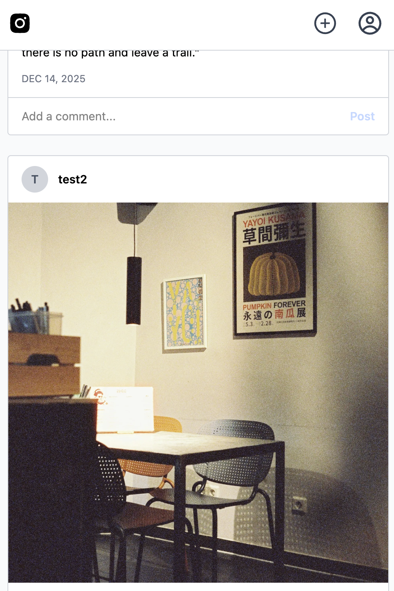

# Instagram Clone

A full-stack social media application replicating Instagram's core features, built with modern web technologies.

## 🚀 Live Demo

[View Live Site](https://instagram-clone-neil.vercel.app)

## Built With

- Next.js 16 (App Router)
- TypeScript
- Tailwind CSS 4
- PostgreSQL
- Prisma ORM
- NextAuth.js
- AWS S3
- React Icons
- Vitest

## Features

- User authentication (email/password, Google, GitHub)
- Photo sharing with captions
- Like and comment on posts
- User profiles with avatars and bios
- Responsive Instagram-inspired UI
- Optimistic UI updates
- Server-side rendering
